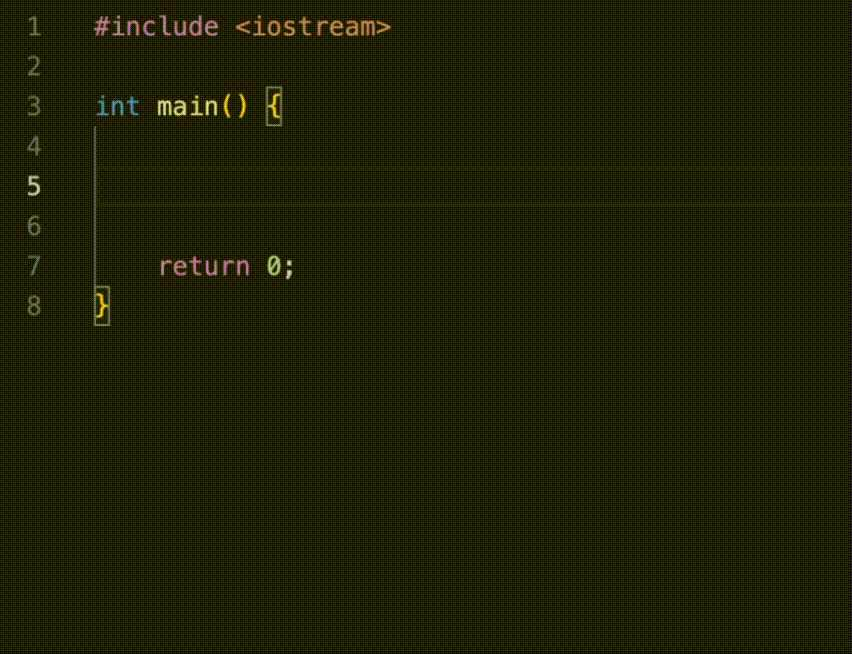

# Blocks Generator

**Клюкин Даниил Станиславович М3102**

## Content

The project contains the plugin JavsScript source files for the Visual Studio Code development environment. The extension allows you to use keyboard shortcuts to generate ready-made templates for conditional statements and loops for C++.



## Main commands

### Generating a conditional `if` statement

When pressing a keyboard shortcut: 
- For Mac: cmd + shift + 9 
- For Windows: ctrl + shift + 9

Will generate: 

```cpp
if () {

}
```

### Generating a conditional `if else` statement

When pressing a keyboard shortcut: 
- For Mac: cmd + shift + 8 
- For Windows: ctrl + shift + 8

Will generate: 

```cpp
else if () {

}
```

### Generating a conditional `else` statement

When pressing a keyboard shortcut: 
- For Mac: cmd + shift + 7 
- For Windows: ctrl + shift + 7

Will generate: 

```cpp
else {

}
```

### Generating a `for` loop

When pressing a keyboard shortcut: 
- For Mac: cmd + shift + 0 
- For Windows: ctrl + shift + 0

Will generate: 

```cpp
for (int i = 0; i < ; ++i) {

}
```

### Generating a `while` loop

When pressing a keyboard shortcut: 
- For Mac: cmd + shift + 2
- For Windows: ctrl + shift + 2

Will generate: 

```cpp
while () {

}
```